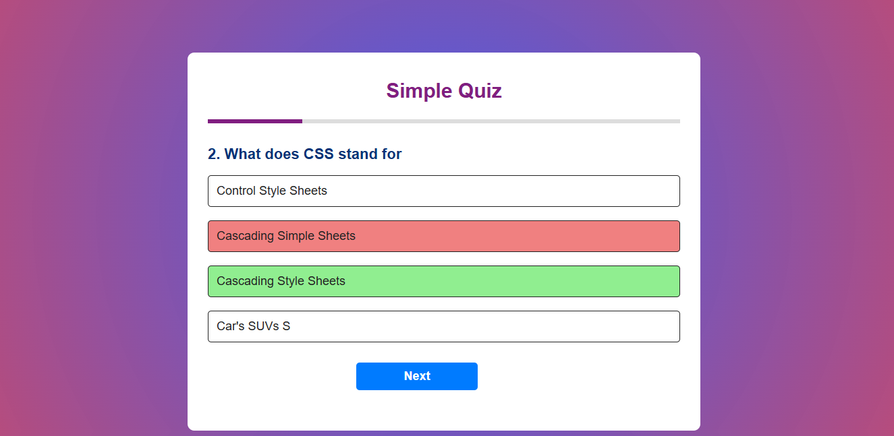
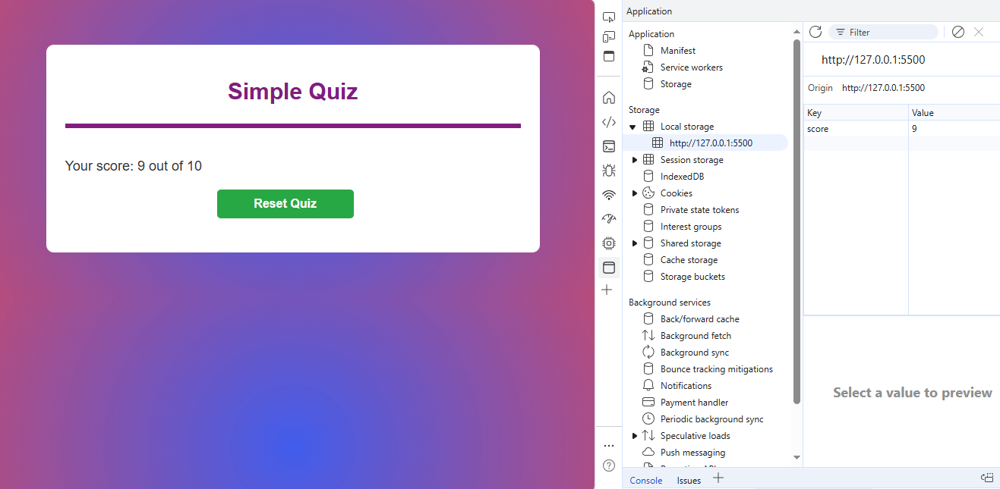
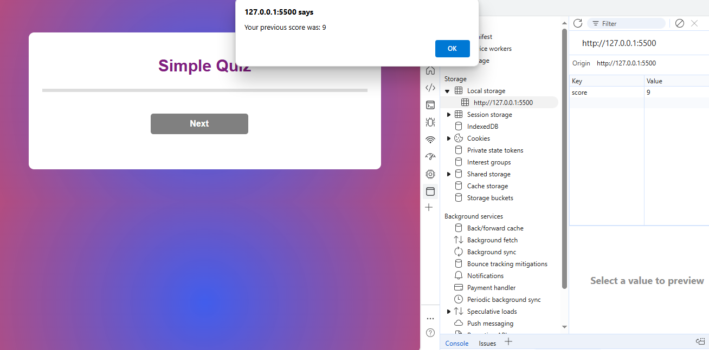

# Quiz App 

The Quiz App is a dynamic, user-friendly web application built using ES6 JavaScript. It allows users to answer multiple-choice questions, and provides feedback at the end of the quiz. The app uses modern ES6 features such as classes, modules, arrow functions, template literals, array methods, and destructuring to ensure clean, modular, and efficient code.

## Key Features

- **Multiple-Choice Questions**: Displays one question at a time with multiple-choice options.
- **Interactive UI**: Buttons to select answers and proceed to the next question.
- **Progress Bar**: Indicates the user’s progress through the quiz visually.
- **Score Display**: Provides final score and feedback upon completion.
- **Persistent Data**: Saves the user’s score in localStorage so it can be viewed after refreshing the page.

## Screenshots

### Screenshot-01

### Screenshot-02

### Screenshot-03

## Technologies Used

- **HTML**:
  - Clean layout to display questions and answers.
  - Button for navigating to the next question.
- **CSS**:
  - Modern and user-friendly design with readable fonts, colors, and spacing.
- **JavaScript (ES6)**:
  - **Classes**: Handles quiz logic and question rendering.
  - **Modules**: Separates logic and question data for better maintainability.
  - **Arrow Functions:**: Used for callbacks and event handlers.
  - **Template Literals:**: Dynamically generates HTML for questions and answers.
  - **Array Methods:**: Efficiently processes and renders questions using .map().
  - **Destructuring**: Extracts data from question objects for clean code.
